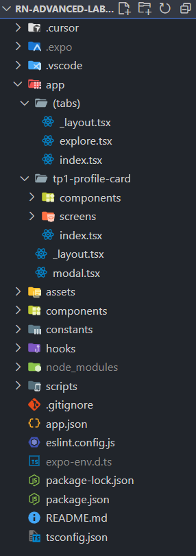

# Bienvenue dans votre application Expo 👋

Ce projet est une application [Expo](https://expo.dev) créée avec [`create-expo-app`](https://www.npmjs.com/package/create-expo-app).

## Commencer

1. Installer les dépendances

   ```bash
   npm install
   ```

2. Démarrer l'application

   ```bash
   npx expo start
   ```

Dans la sortie du terminal, vous trouverez des options pour ouvrir l'application dans :

- un [build de développement](https://docs.expo.dev/develop/development-builds/introduction/)
- un [émulateur Android](https://docs.expo.dev/workflow/android-studio-emulator/)
- un [simulateur iOS](https://docs.expo.dev/workflow/ios-simulator/)
- [Expo Go](https://expo.dev/go), un bac à sable simplifié pour essayer le développement avec Expo

Vous pouvez commencer à développer en modifiant les fichiers du dossier **app**. Ce projet utilise le [routing basé sur le système de fichiers](https://docs.expo.dev/router/introduction).

## TP1 — Initialisation du projet & Premier composant : 
### Arborescence du projet :


### Description
Ce premier TP consiste à mettre en place l'application Expo et à créer un premier écran simple : une carte de profil interactive affichant un utilisateur fictif ("Big Cat"). L'objectif est d'introduire l'état local avec `useState` et la mise à jour de l'interface suite à une interaction utilisateur (bouton Follow / Unfollow).

### Objectifs pédagogiques
- Comprendre la structure d'un projet Expo (routing basé sur les fichiers dans `app/`).
- Manipuler un composant fonctionnel React Native.
- Gérer un état local (compteur de followers + statut de suivi).
- Utiliser des composants de base : `View`, `Text`, `Image`, `Button`.
- Préparer le terrain pour des améliorations futures (persistance, animations, API, styles avancés).

### Composant développé : ProfileCard
Localisation : `app/tp1-profile-card/index.tsx`.

Fonctionnalités :
- Nom : Big Cat.
- Rôle affiché : Développeur Mobile.
- Image distante chargée depuis `https://cataas.com/cat` (aléatoire à chaque reload).
- Compteur de followers dynamique.
- Bouton qui alterne entre Follow / Unfollow et met à jour le compteur (ne descend jamais sous 0).

### Extrait clé
```tsx
const [followers, setFollowers] = useState(0);
const [isFollowing, setIsFollowing] = useState(false);

const toggleFollow = () => {
   setFollowers(prev => (isFollowing ? Math.max(0, prev - 1) : prev + 1));
   setIsFollowing(f => !f);
};
```
