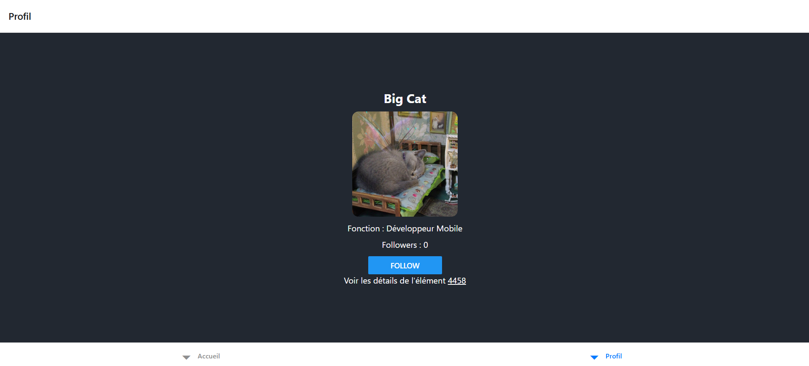
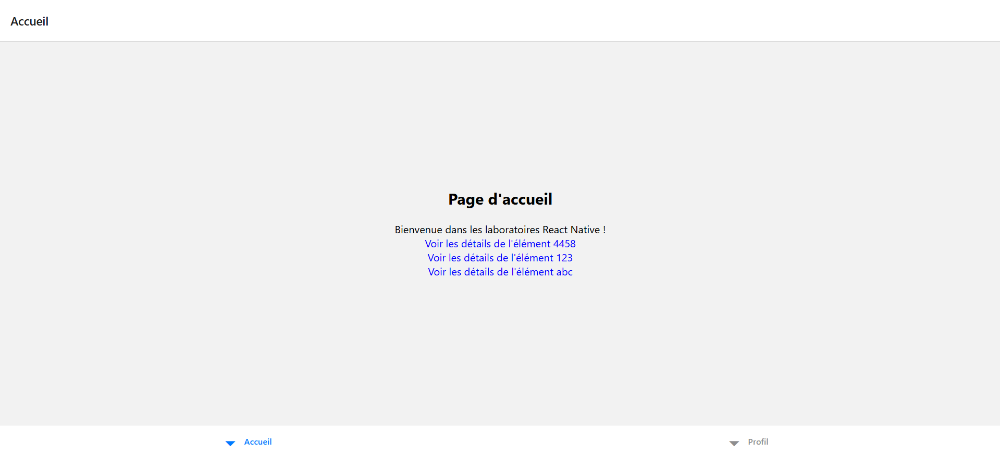
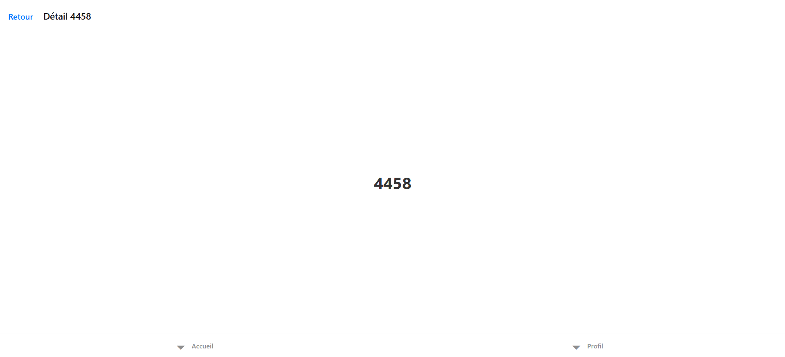
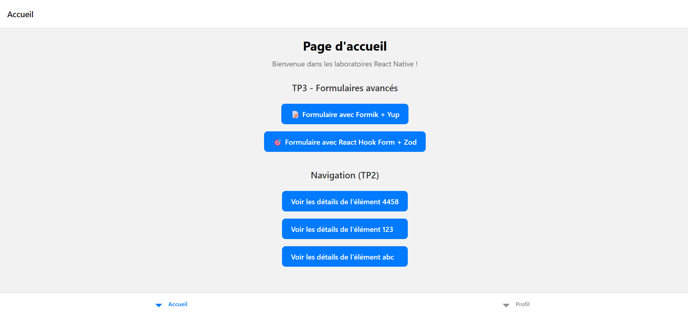
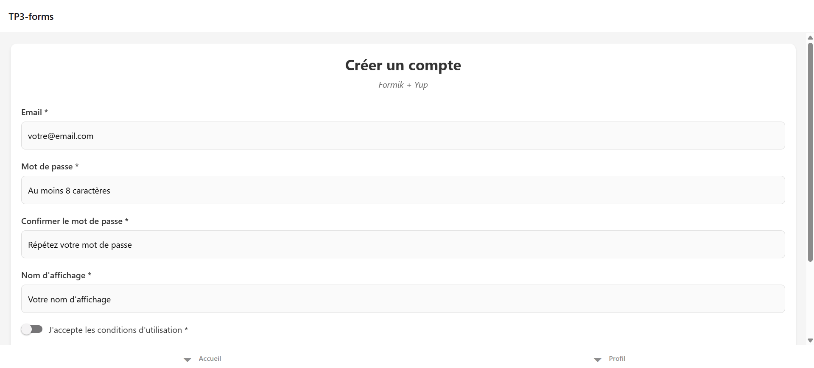
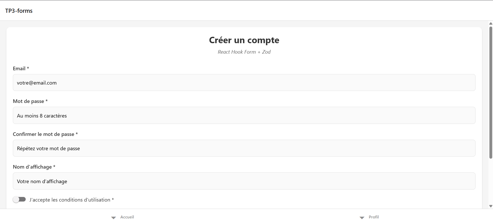

# Bienvenue dans votre application Expo 👋

Ce projet est une application [Expo](https://expo.dev) créée avec [`create-expo-app`](https://www.npmjs.com/package/create-expo-app).

## Commencer

1. Installer les dépendances

   ```bash
   npm install
   ```

2. Démarrer l'application

   ```bash
   npx expo start
   ```

Dans la sortie du terminal, vous trouverez des options pour ouvrir l'application dans :

- un [build de développement](https://docs.expo.dev/develop/development-builds/introduction/)
- un [émulateur Android](https://docs.expo.dev/workflow/android-studio-emulator/)
- un [simulateur iOS](https://docs.expo.dev/workflow/ios-simulator/)
- [Expo Go](https://expo.dev/go), un bac à sable simplifié pour essayer le développement avec Expo

Vous pouvez commencer à développer en modifiant les fichiers du dossier **app**. Ce projet utilise le [routing basé sur le système de fichiers](https://docs.expo.dev/router/introduction).

## TP1 — Initialisation du projet & Premier composant : 
### Arborescence du projet :


### Résultat obtenu : 


### Description
Ce premier TP consiste à mettre en place l'application Expo et à créer un premier écran simple : une carte de profil interactive affichant un utilisateur fictif ("Big Cat"). L'objectif est d'introduire l'état local avec `useState` et la mise à jour de l'interface suite à une interaction utilisateur (bouton Follow / Unfollow).

### Objectifs pédagogiques
- Comprendre la structure d'un projet Expo (routing basé sur les fichiers dans `app/`).
- Manipuler un composant fonctionnel React Native.
- Gérer un état local (compteur de followers + statut de suivi).
- Utiliser des composants de base : `View`, `Text`, `Image`, `Button`.
- Préparer le terrain pour des améliorations futures (persistance, animations, API, styles avancés).

### Composant développé : ProfileCard
Localisation : `app/tp1-profile-card/index.tsx`.

Fonctionnalités :
- Nom : Big Cat.
- Rôle affiché : Développeur Mobile.
- Image distante chargée depuis `https://cataas.com/cat` (aléatoire à chaque reload).
- Compteur de followers dynamique.
- Bouton qui alterne entre Follow / Unfollow et met à jour le compteur (ne descend jamais sous 0).

### Extrait clé
```tsx
const [followers, setFollowers] = useState(0);
const [isFollowing, setIsFollowing] = useState(false);

const toggleFollow = () => {
   setFollowers(prev => (isFollowing ? Math.max(0, prev - 1) : prev + 1));
   setIsFollowing(f => !f);
};
```

## TP2 — Navigation & Persistance de la Dernière Page

### Objectifs du TP
1. Mettre en place une navigation hiérarchique avec **Expo Router** (Stack racine + Tabs + route dynamique).
2. Ajouter un écran de détail dynamique (`detail/[id].tsx`).
3. Persister automatiquement la dernière page visitée pour restaurer la session au redémarrage (cold start).
4. Gérer proprement les erreurs de lecture/écriture (sans faire planter l'app) et prévoir un fallback cohérent.

### Résultat Fonctionnel Attendu
Quand l'utilisateur rouvre l'application après l'avoir complètement fermée, il revient **exactement** sur la même page (y compris une page de détail avec un paramètre dynamique) au lieu de repasser par l'accueil.

### Architecture de Navigation

```
app/
├── _layout.tsx          # Stack racine (active le hook de persistance)
├── index.tsx            # Point d'entrée : restauration ou redirection vers home
└── (main)/
      ├── _layout.tsx      # Tabs (Accueil, Profil, écran dynamique caché)
      ├── home.tsx         # Accueil
      ├── tp1-profile-card.tsx
      └── detail/
            └── [id].tsx     # Écran dynamique (ex: /detail/42)
```

### Détails des Composants Clés

| Fichier | Rôle |
|---------|------|
| `app/_layout.tsx` | Définit le Stack + active `usePersistCurrentUrl()` pour enregistrer chaque changement de route. |
| `app/index.tsx` | Tente de restaurer l'URL persistée puis fait un `Redirect` approprié. |
| `app/(main)/_layout.tsx` | Définit les onglets (`home`, `tp1-profile-card`) et cache l'écran `detail/[id]` (pas de tab). |
| `app/(main)/detail/[id].tsx` | Route dynamique avec bouton retour personnalisé (via navigation stack ou fallback `home`). |
| `hooks/use-persisted-url.ts` | Hook réutilisable qui écoute `usePathname()` et persist le chemin dans AsyncStorage (avec debounce). |

### Implémentation de la Persistance

#### 1. Hook `usePersistCurrentUrl`
Localisation : `hooks/use-persisted-url.ts`

Fonctionnement :
- Observe le `pathname` via `usePathname()` (fourni par Expo Router).
- Débounce (150 ms) pour éviter des écritures inutiles lors de transitions rapides.
- Stocke la valeur dans AsyncStorage sous la clé `LAST_VISITED_URL_V1`.
- Fournit aussi des helpers (`getLastUrl`, `clearLastUrl`) et une fonction hors hook (`fetchLastStoredUrl`).

Extrait simplifié :
```ts
const LAST_URL_KEY = 'LAST_VISITED_URL_V1';
const pathname = usePathname();
useEffect(() => {
   if (!pathname) return;
   // debounce + setItem(pathname)
}, [pathname]);
```

#### 2. Activation dans le Layout Racine
`app/_layout.tsx` :
```tsx
export default function RootLayout() {
   usePersistCurrentUrl(); // Enregistre automatiquement les changements
   return <Stack /* ... */ />;
}
```

#### 3. Restauration au Démarrage
`app/index.tsx` :
```tsx
useEffect(() => {
   (async () => {
      const last = await fetchLastStoredUrl();
      if (last && last.startsWith('/')) {
         router.replace(last);
         return; // Empêche le fallback
      }
      setChecking(false);
   })();
}, []);
```
Affichage intermédiaire : loader + texte "Restauration…" le temps de la lecture.
Si erreur → fallback vers `/(main)/home`.

### Cycle de Vie Résumé
1. L'utilisateur navigue → `pathname` change.
2. Le hook débounce et sauvegarde la route dans AsyncStorage.
3. Cold start → `index.tsx` lit la dernière valeur.
4. Si valide → `router.replace(last)` (pas de flash visible de l'accueil).
5. Sinon → redirection normale vers `/(main)/home`.

### Points Pédagogiques Couverts
- Découverte de la structure **Expo Router** (Stack + Tabs + routes dynamiques).
- Compréhension du couplage navigation ↔ URL dans un contexte React Native.
- Persistance simple d'un état de navigation (pattern réutilisable dans d'autres apps).
- Gestion défensive des erreurs asynchrones.

### Code Source Concerné
- Hook : `hooks/use-persisted-url.ts`
- Activation : `app/_layout.tsx`
- Restauration : `app/index.tsx`
- Route dynamique : `app/(main)/detail/[id].tsx`

### Capture d'écran
Page d'accueil : 

Page détail : 

---
Fin de la section **TP2**.

## TP3 — Formulaires avancés : Formik+Yup **ET** RHF+Zod

### Objectifs pédagogiques
- Construire un formulaire multi-champs robuste avec validation temps réel
- Implémenter **deux versions** : **Formik+Yup** et **React Hook Form+Zod**
- Maîtriser l'**UX mobile** (clavier, focus, haptique, submit conditionnel)
- **Assurer la navigation** depuis l'accueil jusqu'aux deux versions de formulaire

### Arborescence du projet

```
app/(main)/TP3-forms/
├── formik/
│   ├── index.tsx                    # Écran principal Formik + Yup
│   ├── validation/
│   │   └── _schema.ts              # Schéma de validation Yup
│   └── components/
│       ├── _FormContainer.tsx       # Container avec KeyboardAvoidingView
│       ├── _FormInput.tsx          # Champ de saisie réutilisable
│       ├── _FormSwitch.tsx         # Switch avec haptique
│       ├── _SubmitButton.tsx       # Bouton de soumission
│       ├── _FormDebugInfo.tsx      # Informations de debug
│       └── _utils.ts               # Utilitaires (handleFormSubmit)
└── rhf/
    ├── index.tsx                    # Écran principal RHF + Zod
    ├── validation/
    │   └── _schema.ts              # Schéma de validation Zod
    └── components/
        ├── _FormContainer.tsx       # Container avec KeyboardAvoidingView
        ├── _FormInput.tsx          # Champ de saisie réutilisable
        ├── _FormSwitch.tsx         # Switch avec haptique
        ├── _SubmitButton.tsx       # Bouton de soumission
        ├── _FormDebugInfo.tsx      # Informations de debug
        └── _utils.ts               # Utilitaires (handleFormSubmit)
```

### Routes & Navigation

| Route | Description | Accès |
|-------|-------------|-------|
| `/TP3-forms/formik` | Formulaire avec Formik + Yup | Depuis l'accueil → "📝 Formulaire avec Formik + Yup" |
| `/TP3-forms/rhf` | Formulaire avec React Hook Form + Zod | Depuis l'accueil → "🎯 Formulaire avec React Hook Form + Zod" |

**Navigation implémentée :**
- Accès depuis `home.tsx` via des `<Link>` stylisés
- Atteignable en **2 taps max** depuis l'accueil
- **Lien croisé** dans le header pour basculer Formik ⇄ RHF rapidement
- Bouton retour natif fonctionnel

### Choix techniques

#### Formik + Yup
- **Formik** : Gestion d'état de formulaire avec wrapper `<Formik>`
- **Yup** : Validation déclarative avec schéma centralisé
- **Approche** : Props directes (`values`, `errors`, `touched`, `handleChange`)
- **Validation** : `validationSchema` + `validateOnChange`/`validateOnBlur`
- **Avantages** : API mature, documentation complète
- **Inconvénients** : Re-render complet du formulaire, bundle plus lourd

#### React Hook Form + Zod
- **React Hook Form** : Hook `useForm` avec performance optimisée
- **Zod** : Validation TypeScript-first avec `zodResolver`
- **Approche** : `Controller` pour lier les `TextInput` React Native
- **Validation** : Schéma Zod + `z.infer` pour les types automatiques
- **Avantages** : Re-render minimal, bundle plus léger, types automatiques
- **Inconvénients** : Courbe d'apprentissage Controller

### Champs du formulaire
- `email` : Email avec validation format + requis
- `password` : Mot de passe complexe (8+ char, maj/min/chiffre)
- `confirmPassword` : Confirmation avec validation croisée
- `displayName` : Nom d'affichage (2-50 caractères)
- `termsAccepted` : Switch pour acceptation des CGU (requis)

### UX Mobile - Vérifications ✅

#### Clavier & Navigation
- ✅ **KeyboardAvoidingView** : Le clavier ne masque aucun champ
- ✅ **Focus chain** : `email → password → confirmPassword → displayName → submit`
- ✅ **ReturnKeyType** : "next" entre champs, "done" sur le dernier
- ✅ **ScrollView** : Défilement fluide avec `keyboardShouldPersistTaps="handled"`

#### Validation & Submit
- ✅ **Submit désactivé** : Bouton grisé tant que formulaire invalide ou CGU non acceptées
- ✅ **Validation temps réel** : Erreurs affichées dès la saisie/perte de focus
- ✅ **Messages d'erreur clairs** : Textes explicites en français

#### Haptique & Feedback
- ✅ **Haptique succès** : `Haptics.notificationAsync(Success)` lors de la soumission
- ✅ **Haptique erreur** : `Haptics.notificationAsync(Error)` en cas d'échec
- ✅ **Haptique légère** : `Haptics.impactAsync(Light)` sur le switch CGU

#### Post-Submit
- ✅ **Reset automatique** : Formulaire remis à zéro après succès
- ✅ **Message de confirmation** : Alert avec nom et email de l'utilisateur
- ✅ **État de loading** : Bouton "Création en cours..." pendant la simulation API

### Composants réutilisables

Chaque implémentation dispose de ses propres composants dans `components/` :

- **FormContainer** : Wrapper avec KeyboardAvoidingView et ScrollView
- **FormInput** : Champ de saisie avec label, erreur et validation visuelle
- **FormSwitch** : Switch avec haptique intégrée
- **SubmitButton** : Bouton avec états disabled/loading
- **FormDebugInfo** : Affichage de l'état du formulaire (développement)
- **utils** : Fonction `handleFormSubmit` partagée pour la logique post-soumission

### Dépendances ajoutées
```json
{
  "formik": "^2.4.6",
  "yup": "^1.7.0",
  "react-hook-form": "^7.62.0",
  "@hookform/resolvers": "^5.2.2",
  "zod": "^4.1.9"
}
```

### Capture d'écrans : 
Page d'accueil :

1er formulaire : 

2ème formulaire :

---