# Bienvenue dans votre application Expo 👋

Ce projet est une application [Expo](https://expo.dev) créée avec [`create-expo-app`](https://www.npmjs.com/package/create-expo-app).

## Commencer

1. Installer les dépendances

   ```bash
   npm install
   ```

2. Démarrer l'application

   ```bash
   npx expo start
   ```

Dans la sortie du terminal, vous trouverez des options pour ouvrir l'application dans :

- un [build de développement](https://docs.expo.dev/develop/development-builds/introduction/)
- un [émulateur Android](https://docs.expo.dev/workflow/android-studio-emulator/)
- un [simulateur iOS](https://docs.expo.dev/workflow/ios-simulator/)
- [Expo Go](https://expo.dev/go), un bac à sable simplifié pour essayer le développement avec Expo

Vous pouvez commencer à développer en modifiant les fichiers du dossier **app**. Ce projet utilise le [routing basé sur le système de fichiers](https://docs.expo.dev/router/introduction).

## TP1 — Initialisation du projet & Premier composant : 
### Arborescence du projet :
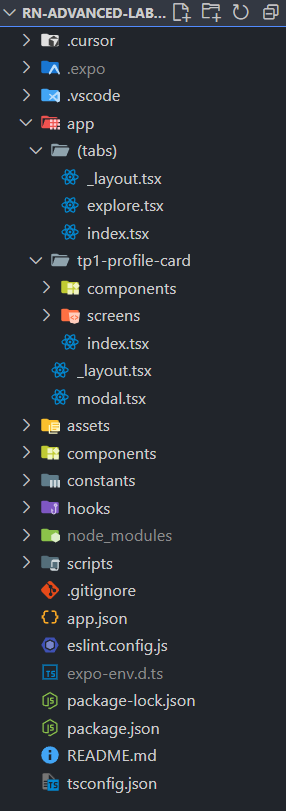

### Résultat obtenu : 
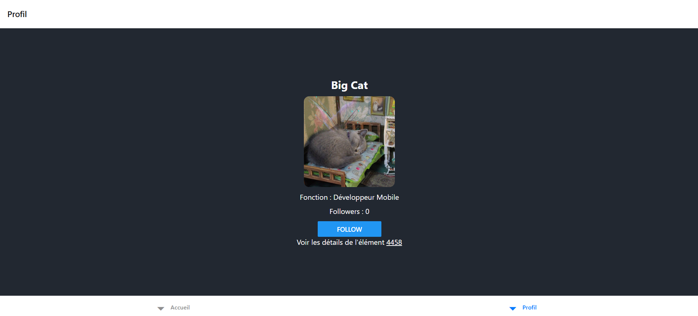

### Description
Ce premier TP consiste à mettre en place l'application Expo et à créer un premier écran simple : une carte de profil interactive affichant un utilisateur fictif ("Big Cat"). L'objectif est d'introduire l'état local avec `useState` et la mise à jour de l'interface suite à une interaction utilisateur (bouton Follow / Unfollow).

### Objectifs pédagogiques
- Comprendre la structure d'un projet Expo (routing basé sur les fichiers dans `app/`).
- Manipuler un composant fonctionnel React Native.
- Gérer un état local (compteur de followers + statut de suivi).
- Utiliser des composants de base : `View`, `Text`, `img-readme/image`, `Button`.
- Préparer le terrain pour des améliorations futures (persistance, animations, API, styles avancés).

### Composant développé : ProfileCard
Localisation : `app/tp1-profile-card/index.tsx`.

Fonctionnalités :
- Nom : Big Cat.
- Rôle affiché : Développeur Mobile.
- img-readme/image distante chargée depuis `https://cataas.com/cat` (aléatoire à chaque reload).
- Compteur de followers dynamique.
- Bouton qui alterne entre Follow / Unfollow et met à jour le compteur (ne descend jamais sous 0).

### Extrait clé
```tsx
const [followers, setFollowers] = useState(0);
const [isFollowing, setIsFollowing] = useState(false);

const toggleFollow = () => {
   setFollowers(prev => (isFollowing ? Math.max(0, prev - 1) : prev + 1));
   setIsFollowing(f => !f);
};
```

## TP2 — Navigation & Persistance de la Dernière Page

### Objectifs du TP
1. Mettre en place une navigation hiérarchique avec **Expo Router** (Stack racine + Tabs + route dynamique).
2. Ajouter un écran de détail dynamique (`detail/[id].tsx`).
3. Persister automatiquement la dernière page visitée pour restaurer la session au redémarrage (cold start).
4. Gérer proprement les erreurs de lecture/écriture (sans faire planter l'app) et prévoir un fallback cohérent.

### Résultat Fonctionnel Attendu
Quand l'utilisateur rouvre l'application après l'avoir complètement fermée, il revient **exactement** sur la même page (y compris une page de détail avec un paramètre dynamique) au lieu de repasser par l'accueil.

### Architecture de Navigation

```
app/
├── _layout.tsx          # Stack racine (active le hook de persistance)
├── index.tsx            # Point d'entrée : restauration ou redirection vers home
└── (main)/
      ├── _layout.tsx      # Tabs (Accueil, Profil, écran dynamique caché)
      ├── home.tsx         # Accueil
      ├── tp1-profile-card.tsx
      └── detail/
            └── [id].tsx     # Écran dynamique (ex: /detail/42)
```

### Détails des Composants Clés

| Fichier | Rôle |
|---------|------|
| `app/_layout.tsx` | Définit le Stack + active `usePersistCurrentUrl()` pour enregistrer chaque changement de route. |
| `app/index.tsx` | Tente de restaurer l'URL persistée puis fait un `Redirect` approprié. |
| `app/(main)/_layout.tsx` | Définit les onglets (`home`, `tp1-profile-card`) et cache l'écran `detail/[id]` (pas de tab). |
| `app/(main)/detail/[id].tsx` | Route dynamique avec bouton retour personnalisé (via navigation stack ou fallback `home`). |
| `hooks/use-persisted-url.ts` | Hook réutilisable qui écoute `usePathname()` et persist le chemin dans AsyncStorage (avec debounce). |

### Implémentation de la Persistance

#### 1. Hook `usePersistCurrentUrl`
Localisation : `hooks/use-persisted-url.ts`

Fonctionnement :
- Observe le `pathname` via `usePathname()` (fourni par Expo Router).
- Débounce (150 ms) pour éviter des écritures inutiles lors de transitions rapides.
- Stocke la valeur dans AsyncStorage sous la clé `LAST_VISITED_URL_V1`.
- Fournit aussi des helpers (`getLastUrl`, `clearLastUrl`) et une fonction hors hook (`fetchLastStoredUrl`).

Extrait simplifié :
```ts
const LAST_URL_KEY = 'LAST_VISITED_URL_V1';
const pathname = usePathname();
useEffect(() => {
   if (!pathname) return;
   // debounce + setItem(pathname)
}, [pathname]);
```

#### 2. Activation dans le Layout Racine
`app/_layout.tsx` :
```tsx
export default function RootLayout() {
   usePersistCurrentUrl(); // Enregistre automatiquement les changements
   return <Stack /* ... */ />;
}
```

#### 3. Restauration au Démarrage
`app/index.tsx` :
```tsx
useEffect(() => {
   (async () => {
      const last = await fetchLastStoredUrl();
      if (last && last.startsWith('/')) {
         router.replace(last);
         return; // Empêche le fallback
      }
      setChecking(false);
   })();
}, []);
```
Affichage intermédiaire : loader + texte "Restauration…" le temps de la lecture.
Si erreur → fallback vers `/(main)/home`.

### Cycle de Vie Résumé
1. L'utilisateur navigue → `pathname` change.
2. Le hook débounce et sauvegarde la route dans AsyncStorage.
3. Cold start → `index.tsx` lit la dernière valeur.
4. Si valide → `router.replace(last)` (pas de flash visible de l'accueil).
5. Sinon → redirection normale vers `/(main)/home`.

### Points Pédagogiques Couverts
- Découverte de la structure **Expo Router** (Stack + Tabs + routes dynamiques).
- Compréhension du couplage navigation ↔ URL dans un contexte React Native.
- Persistance simple d'un état de navigation (pattern réutilisable dans d'autres apps).
- Gestion défensive des erreurs asynchrones.

### Code Source Concerné
- Hook : `hooks/use-persisted-url.ts`
- Activation : `app/_layout.tsx`
- Restauration : `app/index.tsx`
- Route dynamique : `app/(main)/detail/[id].tsx`

### Capture d'écran
Page d'accueil : 
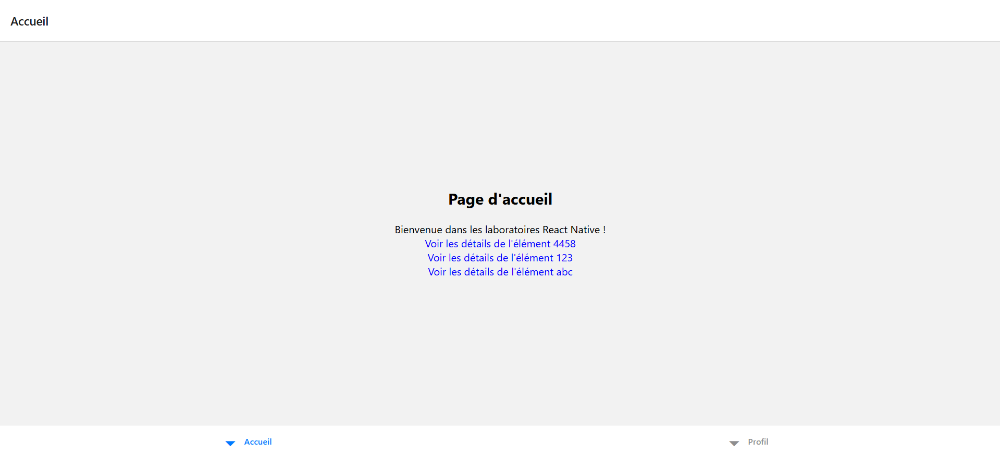
Page détail : 
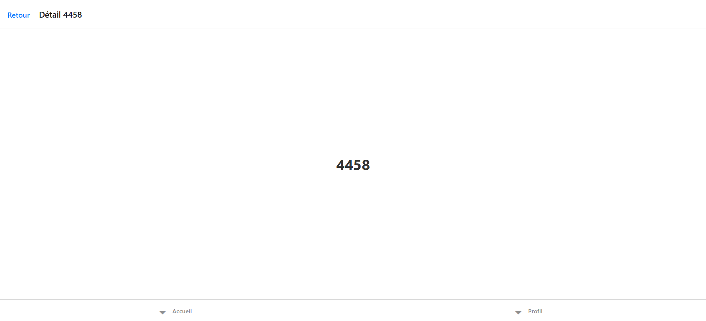
---
Fin de la section **TP2**.

## TP3 — Formulaires avancés : Formik+Yup **ET** RHF+Zod

### Objectifs pédagogiques
- Construire un formulaire multi-champs robuste avec validation temps réel
- Implémenter **deux versions** : **Formik+Yup** et **React Hook Form+Zod**
- Maîtriser l'**UX mobile** (clavier, focus, haptique, submit conditionnel)
- **Assurer la navigation** depuis l'accueil jusqu'aux deux versions de formulaire

### Arborescence du projet

```
app/(main)/TP3-forms/
├── formik/
│   ├── index.tsx                    # Écran principal Formik + Yup
│   ├── validation/
│   │   └── _schema.ts              # Schéma de validation Yup
│   └── components/
│       ├── _FormContainer.tsx       # Container avec KeyboardAvoidingView
│       ├── _FormInput.tsx          # Champ de saisie réutilisable
│       ├── _FormSwitch.tsx         # Switch avec haptique
│       ├── _SubmitButton.tsx       # Bouton de soumission
│       ├── _FormDebugInfo.tsx      # Informations de debug
│       └── _utils.ts               # Utilitaires (handleFormSubmit)
└── rhf/
    ├── index.tsx                    # Écran principal RHF + Zod
    ├── validation/
    │   └── _schema.ts              # Schéma de validation Zod
    └── components/
        ├── _FormContainer.tsx       # Container avec KeyboardAvoidingView
        ├── _FormInput.tsx          # Champ de saisie réutilisable
        ├── _FormSwitch.tsx         # Switch avec haptique
        ├── _SubmitButton.tsx       # Bouton de soumission
        ├── _FormDebugInfo.tsx      # Informations de debug
        └── _utils.ts               # Utilitaires (handleFormSubmit)
```

### Routes & Navigation

| Route | Description | Accès |
|-------|-------------|-------|
| `/TP3-forms/formik` | Formulaire avec Formik + Yup | Depuis l'accueil → "📝 Formulaire avec Formik + Yup" |
| `/TP3-forms/rhf` | Formulaire avec React Hook Form + Zod | Depuis l'accueil → "🎯 Formulaire avec React Hook Form + Zod" |

**Navigation implémentée :**
- Accès depuis `home.tsx` via des `<Link>` stylisés
- Atteignable en **2 taps max** depuis l'accueil
- **Lien croisé** dans le header pour basculer Formik ⇄ RHF rapidement
- Bouton retour natif fonctionnel

### Choix techniques

#### Formik + Yup
- **Formik** : Gestion d'état de formulaire avec wrapper `<Formik>`
- **Yup** : Validation déclarative avec schéma centralisé
- **Approche** : Props directes (`values`, `errors`, `touched`, `handleChange`)
- **Validation** : `validationSchema` + `validateOnChange`/`validateOnBlur`
- **Avantages** : API mature, documentation complète
- **Inconvénients** : Re-render complet du formulaire, bundle plus lourd

#### React Hook Form + Zod
- **React Hook Form** : Hook `useForm` avec performance optimisée
- **Zod** : Validation TypeScript-first avec `zodResolver`
- **Approche** : `Controller` pour lier les `TextInput` React Native
- **Validation** : Schéma Zod + `z.infer` pour les types automatiques
- **Avantages** : Re-render minimal, bundle plus léger, types automatiques
- **Inconvénients** : Courbe d'apprentissage Controller

### Champs du formulaire
- `email` : Email avec validation format + requis
- `password` : Mot de passe complexe (8+ char, maj/min/chiffre)
- `confirmPassword` : Confirmation avec validation croisée
- `displayName` : Nom d'affichage (2-50 caractères)
- `termsAccepted` : Switch pour acceptation des CGU (requis)

### UX Mobile - Vérifications ✅

#### Clavier & Navigation
- ✅ **KeyboardAvoidingView** : Le clavier ne masque aucun champ
- ✅ **Focus chain** : `email → password → confirmPassword → displayName → submit`
- ✅ **ReturnKeyType** : "next" entre champs, "done" sur le dernier
- ✅ **ScrollView** : Défilement fluide avec `keyboardShouldPersistTaps="handled"`

#### Validation & Submit
- ✅ **Submit désactivé** : Bouton grisé tant que formulaire invalide ou CGU non acceptées
- ✅ **Validation temps réel** : Erreurs affichées dès la saisie/perte de focus
- ✅ **Messages d'erreur clairs** : Textes explicites en français

#### Haptique & Feedback
- ✅ **Haptique succès** : `Haptics.notificationAsync(Success)` lors de la soumission
- ✅ **Haptique erreur** : `Haptics.notificationAsync(Error)` en cas d'échec
- ✅ **Haptique légère** : `Haptics.impactAsync(Light)` sur le switch CGU

#### Post-Submit
- ✅ **Reset automatique** : Formulaire remis à zéro après succès
- ✅ **Message de confirmation** : Alert avec nom et email de l'utilisateur
- ✅ **État de loading** : Bouton "Création en cours..." pendant la simulation API

### Composants réutilisables

Chaque implémentation dispose de ses propres composants dans `components/` :

- **FormContainer** : Wrapper avec KeyboardAvoidingView et ScrollView
- **FormInput** : Champ de saisie avec label, erreur et validation visuelle
- **FormSwitch** : Switch avec haptique intégrée
- **SubmitButton** : Bouton avec états disabled/loading
- **FormDebugInfo** : Affichage de l'état du formulaire (développement)
- **utils** : Fonction `handleFormSubmit` partagée pour la logique post-soumission

### Dépendances ajoutées
```json
{
  "formik": "^2.4.6",
  "yup": "^1.7.0",
  "react-hook-form": "^7.62.0",
  "@hookform/resolvers": "^5.2.2",
  "zod": "^4.1.9"
}
```

### Capture d'écrans : 
Page d'accueil :
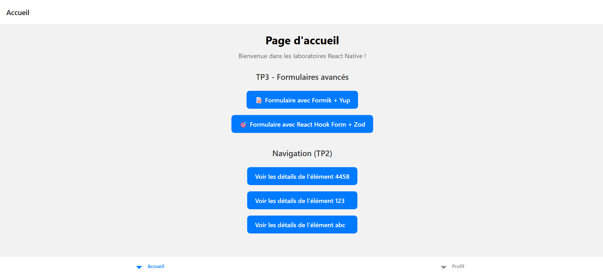
1er formulaire : 
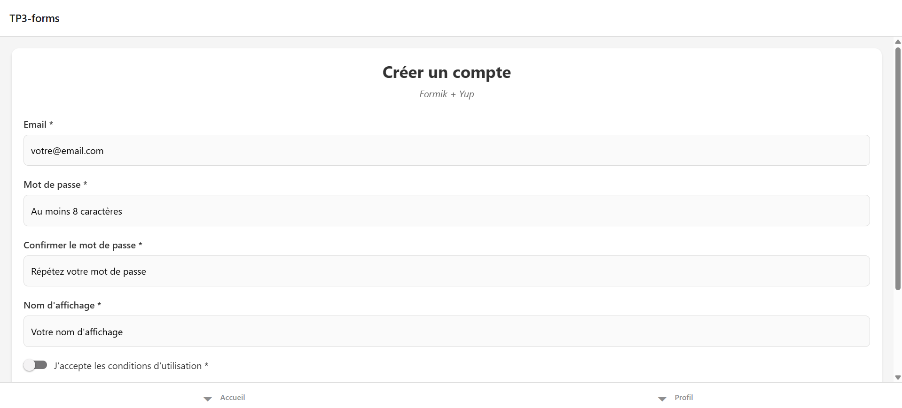
2ème formulaire :
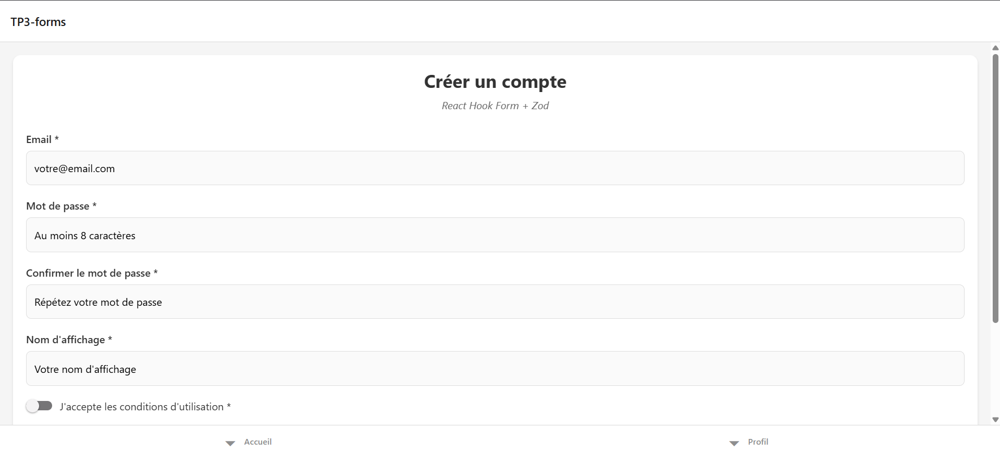
---

## TP4-A — Zustand : CRUD "Robots" (liste + formulaire + delete)

### 🎯 Objectifs réalisés

Ce TP implémente un système CRUD complet pour la gestion de robots en utilisant **Zustand** comme store global, **React Hook Form + Zod** pour la validation, et **Expo Router** pour la navigation.

### 📋 Modèle Robot & Contraintes métier

**Structure Robot :**
```typescript
interface Robot {
  id: string;        // UUID généré automatiquement
  name: string;      // min 2 caractères, obligatoire, unique
  label: string;     // min 3 caractères, obligatoire
  year: number;      // entier entre 1950 et année courante
  type: RobotType;   // enum: industrial | service | medical | educational | other
}
```

**Contraintes implémentées :**
- ✅ Unicité du `name` (vérification en temps réel)
- ✅ Validation `year` : 1950 ≤ année ≤ 2025
- ✅ Sélection `type` via sélecteur natif (ActionSheet iOS / Alert Android)

### 🏗️ Architecture & Arborescence

```
app/(main)/tp4A-robots/
  ├── index.tsx            # 📋 Liste des robots (triée par année)
  ├── create.tsx           # ➕ Écran création
  ├── edit/[id].tsx        # ✏️ Écran édition
  └── _layout.tsx          # 🧭 Navigation Stack

store/
  └── robotsStore.ts       # 🏪 Store Zustand + persistance

validation/
  └── robotSchema.ts       # ✅ Schema Zod + contraintes

types/
  └── robot.ts            # 🔧 Types TypeScript + enum

components/
  ├── RobotForm.tsx        # 📝 Formulaire réutilisable
  └── RobotListItem.tsx    # 📄 Item de liste + actions
```

### 🗂️ Choix technique : React Hook Form + Zod

**Pourquoi RHF + Zod au lieu de Formik + Yup ?**

| Critère | React Hook Form + Zod | Formik + Yup |
|---|---|---|
| **Performance** | ✅ Moins de re-renders | ❌ Re-render à chaque saisie |
| **TypeScript** | ✅ Intégration native avec Zod | ⚠️ Types séparés |
| **Bundle size** | ✅ Plus léger | ❌ Plus lourd |
| **API moderne** | ✅ Hooks + composition | ⚠️ Render props |
| **Validation async** | ✅ Intégrée | ⚠️ Plus complexe |

### 🏪 Store Zustand avec persistance

**État global :**
```typescript
interface RobotsState {
  robots: Robot[];
  selectedId?: string;
  
  // Actions CRUD
  create: (robotInput: RobotInput) => Robot;
  update: (id: string, robotInput: RobotInput) => Robot | null;
  remove: (id: string) => boolean;
  getById: (id: string) => Robot | undefined;
  
  // Utilitaires
  getAllRobots: () => Robot[];
  isNameUnique: (name: string, excludeId?: string) => boolean;
}
```

**Persistance AsyncStorage :**
- Middleware `persist` avec `createJSONStorage`
- Sauvegarde automatique après chaque modification
- Restauration au redémarrage de l'app

### 🛣️ Routes de navigation

| Route | Écran | Description |
|---|---|---|
| `/tp4A-robots` | Liste | Affichage des robots + bouton flottant |
| `/tp4A-robots/create` | Création | Formulaire en mode modal |
| `/tp4A-robots/edit/[id]` | Édition | Formulaire pré-rempli en mode modal |

**Navigation configurée :**
- Tab "Robots" dans la navigation principale
- Retour automatique après création/édition
- Gestion des erreurs (robot introuvable)

### ✅ Validation complète

**Schema Zod implémenté :**
```typescript
export const robotSchema = z.object({
  name: z.string()
    .min(2, 'Min 2 caractères')
    .max(50, 'Max 50 caractères')
    .trim(),
  label: z.string()
    .min(3, 'Min 3 caractères')
    .max(100, 'Max 100 caractères'),
  year: z.number()
    .int('Doit être un entier')
    .min(1950, 'Année min: 1950')
    .max(2025, 'Année max: 2025'),
  type: z.nativeEnum(RobotType)
});
```

**Validation d'unicité dynamique :**
- Vérification en temps réel du nom
- Exclusion du robot actuel en mode édition
- Messages d'erreur contextuels

### 📱 UX Mobile optimisée

**Fonctionnalités implémentées :**
- ✅ `KeyboardAvoidingView` : clavier ne masque pas les champs
- ✅ Navigation entre champs : `returnKeyType="next"` + `onSubmitEditing`
- ✅ Bouton submit désactivé si formulaire invalide
- ✅ Feedback haptique : vibrations sur succès/erreur (iOS/Android)
- ✅ Sélecteur type natif : ActionSheet (iOS) / Alert (Android)
- ✅ Bouton flottant pour création (FAB avec ombre)

### 📋 Fonctionnalités de la liste

**Affichage :**
- Tri automatique par année (plus récent en premier)
- Indicateur de tri : "X robots (trié par année)"
- Design cards avec élévation/ombre
- États vides avec CTA de création

**Actions par robot :**
- **✏️ Éditer** : Navigation vers `/tp4A-robots/edit/[id]`
- **🗑️ Supprimer** : Confirmation + suppression + feedback

### 🧪 Tests manuels réalisés

**✅ CREATE - Création de robot :**
- ✅ Cas réussite : Robot créé → apparaît dans la liste
- ✅ Cas échec nom dupliqué : Erreur "Ce nom existe déjà"
- ✅ Cas échec année invalide : Erreur "Année min: 1950"
- ✅ Validation temps réel : bouton désactivé si invalide

**✅ UPDATE - Modification de robot :**
- ✅ Chargement valeurs existantes dans le formulaire
- ✅ Modification label/type → sauvegarde → liste mise à jour
- ✅ Navigation retour automatique après succès

**✅ DELETE - Suppression de robot :**
- ✅ Confirmation avant suppression
- ✅ Robot supprimé → disparaît de la liste
- ✅ Feedback haptique + message de confirmation

**✅ PERSISTANCE - Sauvegarde locale :**
- ✅ Créer 2 robots → fermer app → rouvrir → robots présents
- ✅ Modifications persistées après redémarrage
- ✅ AsyncStorage fonctionnel

**✅ UX - Expérience utilisateur :**
- ✅ Clavier ne masque pas le bouton submit
- ✅ Submit désactivé tant que formulaire invalide
- ✅ Navigation fluide entre les champs
- ✅ Sélecteur type fonctionnel sur iOS/Android

### 📦 Dépendances ajoutées

```json
{
  "zustand": "^5.0.0",
  "react-hook-form": "^7.62.0",
  "@hookform/resolvers": "^5.2.2",
  "zod": "^4.1.9",
  "@react-native-async-storage/async-storage": "^1.25.0"
}
```

### 📸 Captures d'écran

**Liste des robots :**
<!-- TODO: Ajouter capture liste robots -->

**Écran de création :**
<!-- TODO: Ajouter capture formulaire création -->

**Écran d'édition :**
<!-- TODO: Ajouter capture formulaire édition -->

**Sélecteur de type (iOS) :**
<!-- TODO: Ajouter capture ActionSheet iOS -->

**Validation d'erreurs :**
<!-- TODO: Ajouter capture erreurs validation -->

### 🔗 Navigation depuis l'accueil

Un lien "🤖 Gestionnaire de Robots" a été ajouté dans la section TP4-A de la page d'accueil, permettant l'accès direct à la liste des robots.

## TP4-B — Redux Toolkit : CRUD “Robots” (liste + formulaire + delete)

### 🎯 Objectifs réalisés
Ce TP implémente un système CRUD complet pour la gestion de robots en utilisant Redux Toolkit comme store global, React Hook Form + Zod pour la validation, et Expo Router pour la navigation. Cette version utilise Redux Toolkit au lieu de Zustand pour illustrer une approche de gestion d'état plus structurée et adaptée aux applications complexes.

### 📋 Modèle Robot & Contraintes métier
Structure Robot :
```typescript
interface Robot {
  id: string;        // UUID généré automatiquement
  name: string;      // min 2 caractères, obligatoire, unique
  label: string;     // min 3 caractères, obligatoire
  year: number;      // entier entre 1950 et année courante
  type: RobotType;   // enum: industrial | service | medical | educational | other
}
```

### Contraintes implémentées :
✅ Unicité du name (vérification en temps réel)
✅ Validation year : 1950 ≤ année ≤ 2025
✅ Sélection type via sélecteur natif (ActionSheet iOS / Alert Android)
✅ Réutilisation du modèle et validation du TP4-A

### 🏗️ Architecture & Arborescence

```
app/(main)/tp4B-robots/
  ├── index.tsx            # 📋 Liste des robots (triée par année)
  ├── create.tsx           # ➕ Écran création
  ├── edit/[id].tsx        # ✏️ Écran édition
  └── _layout.tsx          # 🧭 Navigation Stack

app/
  ├── _layout.tsx          # 🔴 Provider Redux intégré
  ├── store.ts             # 🏪 Configuration du store Redux
  └── rootReducer.ts       # 🔄 Combinaison des reducers

features/
  └── robotsRedux/
      ├── robotsSlice.ts   # 📦 Slice Redux avec actions & reducers
      └── selectors.ts     # 🔍 Sélecteurs mémorisés (Reselect)

validation/
  └── robotSchema.ts       # ✅ Schema Zod + contraintes (réutilisé)

types/
  └── robot.ts            # 🔧 Types TypeScript + enum (réutilisé)

components/
  ├── RobotForm.tsx        # 📝 Formulaire réutilisable (réutilisé)
  └── RobotListItem.tsx    # 📄 Item de liste + actions (réutilisé)
```

### 🗂️ Choix technique : form stack

Pourquoi React Hook Form + Zod pour le TP4-B ?

Pour faciliter la comparaison directe entre Zustand (TP4-A) et Redux Toolkit (TP4-B), nous avons réutilisé exactement la même stack de formulaires : React Hook Form + Zod.

Raisons stratégiques :

Isolation de la variable : La seule différence entre TP4-A et TP4-B est la gestion d'état (Zustand vs Redux). Garder les formulaires identiques permet de comparer uniquement l'impact du store global.
Composants réutilisables : RobotForm.tsx et robotSchema.ts sont partagés entre les deux TPs via une prop useRedux.
Performance optimale : RHF + Zod reste le meilleur choix pour les formulaires React Native (moins de re-renders, types automatiques).
Cohérence pédagogique : Les étudiants peuvent se concentrer sur Redux Toolkit sans réapprendre une nouvelle bibliothèque de formulaires.
Implémentation partagée :

Alternatives écartées :

❌ Formik + Yup : Aurait introduit une variable supplémentaire (difficile de savoir si les différences viennent du store ou des formulaires).
❌ Formulaires natifs : Pas de validation robuste, aurait complexifié le code inutilement.

### 🛣️ Routes de navigation
Route	Écran	Description
/tp4B-robots	Liste	Affichage des robots + bouton flottant
/tp4B-robots/create	Création	Formulaire en mode modal
/tp4B-robots/edit/[id]	Édition	Formulaire pré-rempli en mode modal

Navigation configurée :

Tab "Redux Robots" dans la navigation principale
Retour automatique après création/édition
Gestion des erreurs (robot introuvable)
Architecture identique au TP4-A pour faciliter la comparaison

### Images et captures d'écran
Supression d'un robot :
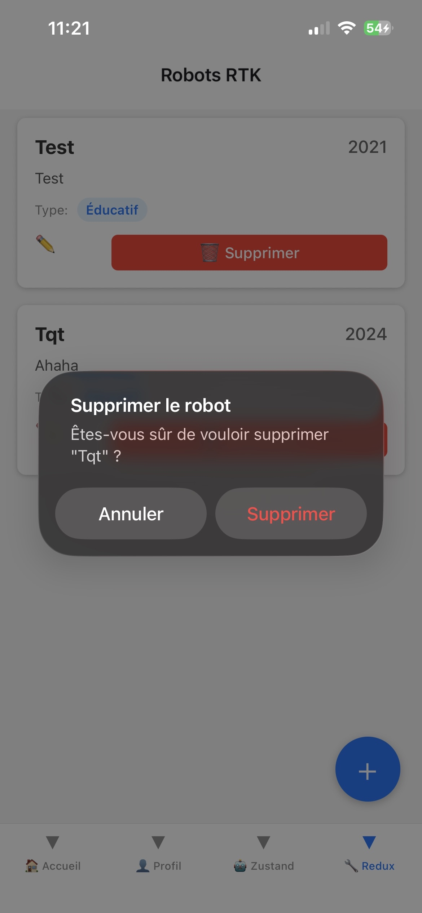

Création d'un robot :
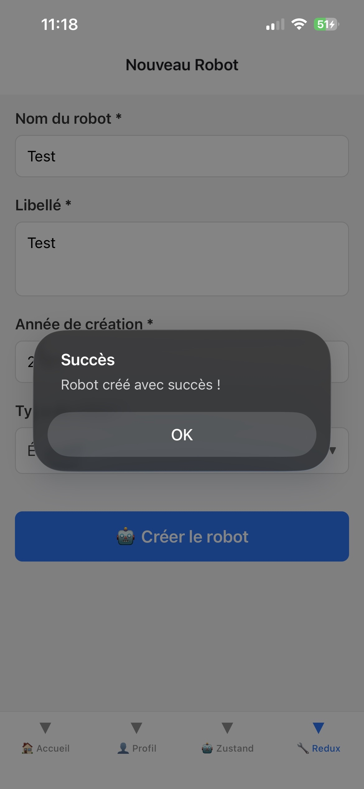

Création d'un robot avec erreur de validation :
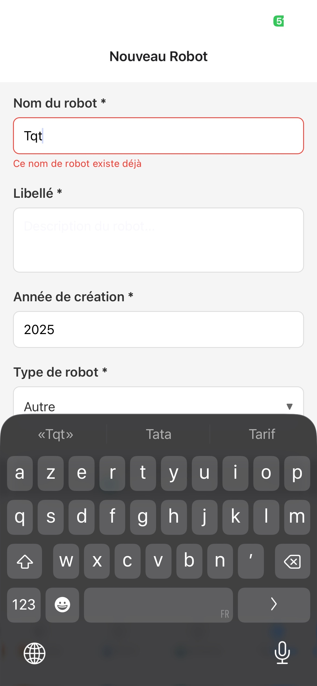
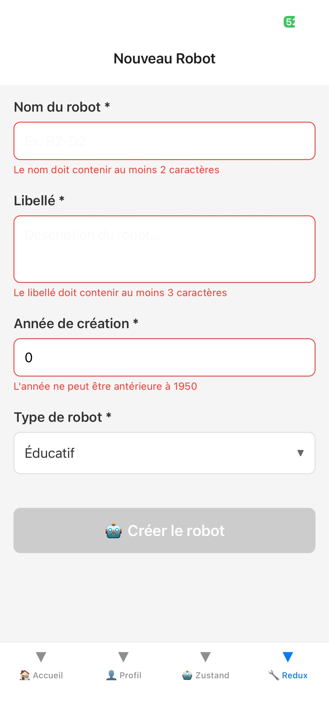

# TP5 — Stockage local avec SQLite : Robots Offline

Application React Native avec gestion complète de robots stockés localement dans une base SQLite.

---

## 🎯 Objectifs atteints

✅ Base de données SQLite locale créée et gérée  
✅ Système de migrations versionnées (v1, v2, v3) avec `PRAGMA user_version`  
✅ CRUD complet (Create, Read, Update, Delete)  
✅ Export JSON des données  
✅ Interface utilisateur réactive avec rechargement automatique  
✅ Validation stricte des données (nom unique, année valide)  

---

## 📦 Dépendances et leur rôle

### Dépendances principales
- **expo-sqlite** : Gestion de la base de données SQLite locale
- **expo-file-system** : Export/import de fichiers JSON
- **react-native-uuid** : Génération d'identifiants uniques pour les robots

### Stack de formulaires
- **react-hook-form** : Gestion performante des formulaires avec validation en temps réel
- **@hookform/resolvers** : Intégration des schémas de validation avec react-hook-form
- **zod** : Validation de schéma TypeScript-first, garantit la conformité des données

### Fonctionnement offline
- Toutes les données sont stockées localement dans SQLite
- Aucune dépendance à un serveur distant
- Persistance complète entre les redémarrages

---

## 🗄️ Structure de la base de données

### Table `robots`

| Colonne | Type | Contraintes | Description |
|---------|------|-------------|-------------|
| `id` | TEXT | PRIMARY KEY | Identifiant unique UUID |
| `name` | TEXT | UNIQUE, NOT NULL | Nom du robot (min 2 caractères) |
| `label` | TEXT | NOT NULL | Description (min 3 caractères) |
| `year` | INTEGER | NOT NULL | Année de création (1950-2025) |
| `type` | TEXT | CHECK, NOT NULL | Type: industrial, service, medical, educational, other |
| `created_at` | TEXT | NOT NULL | Date ISO de création |
| `updated_at` | TEXT | NOT NULL | Date ISO de dernière modification |
| `archived` | INTEGER | DEFAULT 0 | Indicateur de suppression logique (0=actif, 1=archivé) |

### Index pour performance
- `idx_robots_name` : Index sur la colonne `name` pour accélérer les recherches
- `idx_robots_year` : Index sur la colonne `year` pour accélérer les tris

---

## 🔄 Système de migrations

### Stratégie de versioning
- Utilisation de `PRAGMA user_version` pour tracker la version du schéma
- Migrations incrémentales appliquées automatiquement au démarrage
- Pas de perte de données lors des mises à jour

### Migrations implémentées

#### **Migration 001** : Initialisation
```sql
CREATE TABLE IF NOT EXISTS robots (
  id TEXT PRIMARY KEY NOT NULL,
  name TEXT NOT NULL UNIQUE,
  label TEXT NOT NULL,
  year INTEGER NOT NULL,
  type TEXT NOT NULL CHECK(type IN ('industrial', 'service', 'medical', 'educational', 'other')),
  created_at TEXT NOT NULL,
  updated_at TEXT NOT NULL
);
```

#### **Migration 002** : Index de performance
```sql
CREATE INDEX IF NOT EXISTS idx_robots_name ON robots(name);
CREATE INDEX IF NOT EXISTS idx_robots_year ON robots(year);
```

#### **Migration 003** : Suppression logique
```sql
ALTER TABLE robots ADD COLUMN archived INTEGER DEFAULT 0;
```

### Fonctionnement
1. Au démarrage, `initDatabase()` est appelé
2. Le système vérifie `PRAGMA user_version`
3. Les migrations manquantes sont appliquées séquentiellement
4. La version est incrémentée après chaque migration
5. Logs console pour tracer l'évolution

---

### 📂 Architecture du code

```
app/(main)/TP5-robots-db/
  ├── _layout.tsx          # Configuration Stack Navigator
  ├── index.tsx            # Liste avec recherche, delete, export
  ├── create.tsx           # Écran création robot
  └── edit/[id].tsx        # Écran édition robot (param dynamique)

db/
  ├── index.ts             # Gestionnaire DB + runner de migrations
  └── migrations/          # Fichiers SQL (documentés)
      ├── 001_init.sql
      ├── 002_add_indexes.sql
      └── 003_add_archived.sql

services/
  └── robotRepo.ts         # Repository (DAO) - toutes requêtes SQL

components/
  └── RobotForm.tsx        # Formulaire réutilisable (create/edit)

types/
  └── robot.ts             # Types TypeScript (Robot, RobotType, etc.)

validation/
  └── robotSchema.ts       # Schéma Zod avec validation unicité
```

---

## ✨ Fonctionnalités implémentées

### CRUD complet ✅
- **CREATE** : Création avec validation temps réel (nom unique, année valide, type requis)
- **READ** : Liste paginée (limit/offset), recherche par nom, tri par name/year
- **UPDATE** : Modification avec mise à jour automatique de `updated_at`
- **DELETE** : Suppression définitive (hard delete) avec confirmation

## 🧪 Tests manuels effectués

### 1. Migrations versionnées ✅
- **Test** : Premier lancement de l'app
  - ✅ Console affiche "Version actuelle de la DB: 0"
  - ✅ Migrations 1, 2, 3 appliquées successivement
  - ✅ Table `robots` créée avec tous les champs
  
- **Test** : Redémarrage de l'app
  - ✅ Console affiche "Version actuelle de la DB: 3"
  - ✅ Aucune migration réappliquée
  - ✅ Données préservées

- **Test** : Ajout d'une migration v4 (simulation)
  - ✅ Seule la nouvelle migration s'exécute
  - ✅ Pas de perte de données existantes

### 2. CRUD complet ✅
- **CREATE** :
  - ✅ Création robot "R2-D2", type: industrial, année: 2024
  - ✅ Validation bloque nom < 2 caractères
  - ✅ Validation bloque nom déjà existant
  - ✅ Validation bloque année < 1950 ou > 2025
  - ✅ Message succès + retour liste automatique
  
- **READ** :
  - ✅ Liste affiche tous les robots par ordre alphabétique
  - ✅ Affichage: nom (gras), label, année
  - ✅ Chaque item a boutons "Éditer" et "Supprimer"
  
- **UPDATE** :
  - ✅ Modification nom: validation unicité respectée
  - ✅ Modification année: validation 1950-2025 appliquée
  - ✅ Champ `updated_at` mis à jour automatiquement
  - ✅ Retour liste avec données actualisées
  
- **DELETE** :
  - ✅ Alert de confirmation apparaît
  - ✅ Suppression effective en base
  - ✅ Liste rafraîchie immédiatement

### 3. Persistance ✅
- **Test** : Créer 3 robots → Fermer app → Rouvrir
  - ✅ Les 3 robots sont toujours présents
  - ✅ Dates `created_at` et `updated_at` préservées
  - ✅ Ordre de tri conservé

### 4. Export JSON ✅
- **Test** : Créer 5 robots → Cliquer "Exporter JSON"
  - ✅ Alert succès avec chemin fichier
  - ✅ Fichier `robots_export.json` créé dans DocumentDirectory
  - ✅ Contenu : array JSON valide avec les 5 robots
  - ✅ Tous les champs présents (id, name, label, year, type, dates, archived)

### 5. Recherche et filtrage ✅
- **Test** : Taper "R2" dans la barre de recherche
  - ✅ Résultats filtrés en temps réel
  - ✅ Délai de 300ms respecté (pas de requête à chaque frappe)
  - ✅ Requête SQL LIKE paramétrée (`%R2%`)
  
- **Test** : Effacer la recherche
  - ✅ Liste complète réapparaît

### 6. Rechargement automatique ✅
- **Test** : Créer robot → Revenir sur liste
  - ✅ `useFocusEffect` déclenché
  - ✅ Nouveau robot visible sans action manuelle
  
- **Test** : Pull-to-refresh
  - ✅ Glisser vers le bas active le spinner
  - ✅ Données rechargées depuis SQLite

---

## 📸 Captures d'écran
création d'un robot :


robot créé :


Liste robots :


Export :


Recherche :


Suppression :


# TP6 — Caméra (Expo) : capture, stockage local & galerie

Application mobile permettant de capturer des photos, de les stocker localement et de les visualiser dans une galerie. Toutes les photos restent **dans l'application** (DocumentDirectory).

### 1) Dépendances

```json
{
  "expo-camera"
  "expo-file-system"
}
```

- **`expo-camera`** : Accès à la caméra, prévisualisation temps réel et capture de photos via `CameraView`.
- **`expo-file-system`** : Stockage, lecture et suppression de fichiers locaux. Utilise la nouvelle API v18+ (`Paths`, `Directory`, `File`).

### 2) Permissions

#### Déclaration (`app.json`)
```json
{
  "expo": {
    "ios": {
      "infoPlist": {
        "NSCameraUsageDescription": "Cette application a besoin d'accéder à la caméra pour capturer des photos."
      }
    },
    "android": {
      "permissions": ["CAMERA"]
    }
  }
}
```

#### Runtime
- Permission demandée à l'entrée de l'écran Caméra via `useCameraPermission.ts`.
- En cas de refus : message clair + bouton "Ouvrir les paramètres".

### 3) Architecture

```
app/(main)/TP6-camera/
├── _layout.tsx                    # Stack navigation
├── index.tsx                      # Galerie (liste miniatures)
├── camera.tsx                     # Capture
├── detail/[id].tsx                # Détail photo
└── lib/
    ├── camera/
    │   ├── storage.ts             # Service CRUD (savePhoto, listPhotos, getPhoto, deletePhoto)
    │   └── types.ts               # Type Photo
    └── hooks/
        └── useCameraPermission.ts
```

**Principe** : Aucun accès direct à `FileSystem` dans l'UI. Tout passe par `storage.ts`.

### API du service storage
```typescript
async function savePhoto(uri: string): Promise<Photo>
async function listPhotos(): Promise<Photo[]>
async function getPhoto(id: string): Promise<Photo | null>
async function deletePhoto(id: string): Promise<void>
```

### 4) Capture & enregistrement local

#### Écran Caméra
- Prévisualisation plein écran (caméra arrière par défaut)
- Bouton flip pour basculer avant/arrière
- Bouton capture (85x85px)
- Enregistrement automatique : `photo_<timestamp>.jpg` dans `documentDirectory/photos/`
- Retour automatique vers la galerie

#### Métadonnées stockées
```typescript
{
  id: "photo_1234567890123",
  uri: "file:///path/to/photo.jpg",
  createdAt: 1234567890123,  // timestamp
  size: 1234567              // bytes
}
```

### 5) Galerie

#### Écran Galerie (`index.tsx`)
- Grille 3 colonnes responsive (`FlatList`)
- Header avec compteur de photos
- Bouton flottant 📷 (64x64px) en bas à droite
- Pull-to-refresh
- Rechargement auto au retour de la caméra (`useFocusEffect`)
- Message "Aucune photo" si vide

### 6) Détail d'une photo

### Écran Détail (`detail/[id].tsx`)
- Affichage plein écran
- **Tap-to-hide** : tap sur l'image → masque/affiche overlays (animation 200ms)
- Métadonnées : nom fichier, date (DD/MM/YYYY HH:mm), taille
- Action **Supprimer** : confirmation → suppression physique → retour galerie

### 7) Navigation (Expo Router)

```
/TP6-camera              → Galerie
/TP6-camera/camera       → Caméra
/TP6-camera/detail/[id]  → Détail
```

Point d'entrée : navbar principale (onglet 📷 Caméra) + page d'accueil.

### 9) Qualité & architecture

#### Service storage
- **Single Responsibility** : chaque fonction un rôle unique
- **Error Handling** : erreurs catchées et loggées
- **Type Safety** : TypeScript strict
- **Encapsulation** : chemins fichiers non exposés

#### Nouvelle API FileSystem
```typescript
const PHOTOS_DIR = new Directory(Paths.document, 'photos');
const destFile = new File(PHOTOS_DIR, fileName);
await srcFile.copy(destFile);
```

### 10) Tests manuels

| Test | Résultat |
|------|----------|
| **Permissions** : refuser → message + bouton paramètres | ✅ PASS |
| **Capture multiple** : 2 photos → 2 miniatures visibles | ✅ PASS |
| **Détail** : métadonnées affichées + tap-to-hide fluide | ✅ PASS |
| **Suppression** : confirmation → fichier supprimé | ✅ PASS |
| **Persistance** : redémarrage app → photos toujours là | ✅ PASS |
| **Bascule caméra** : flip avant/arrière instantané | ✅ PASS |
| **Galerie vide** : message clair + bouton caméra OK | ✅ PASS |

### 11) Captures d'écran :
Galerie vide :
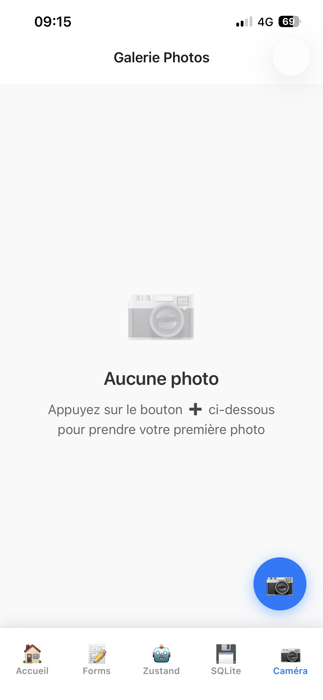

Écran caméra :
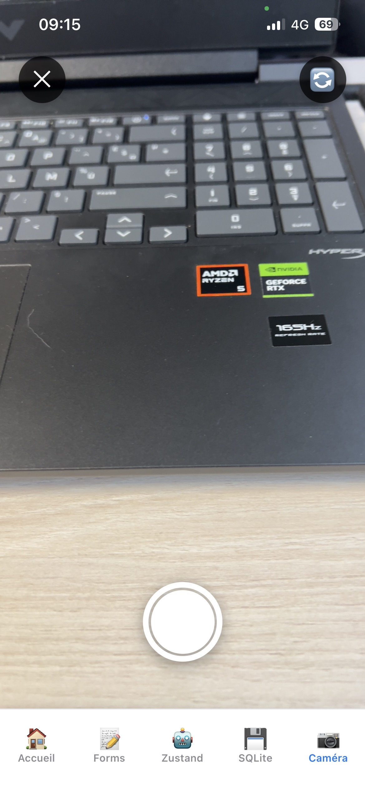

Galerie avec photos :
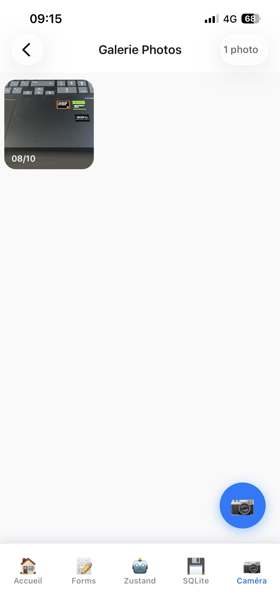

Affichage détail :
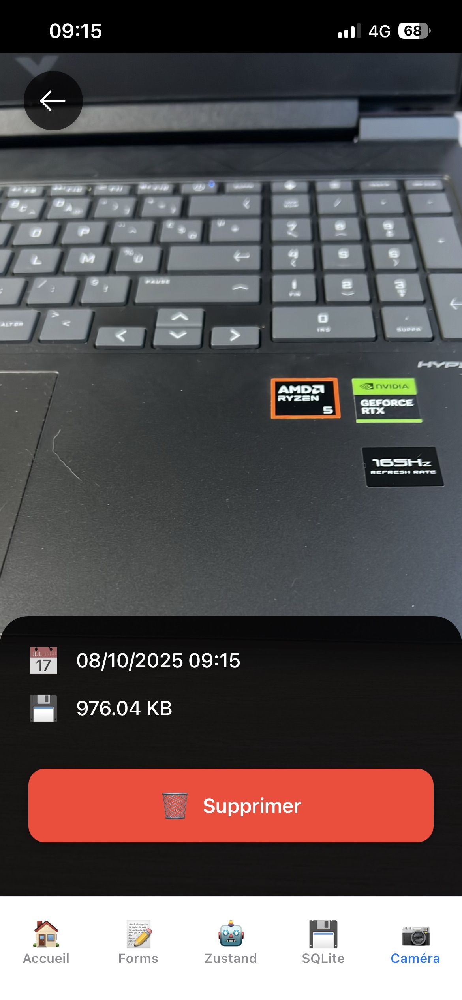

Suppression photo :
